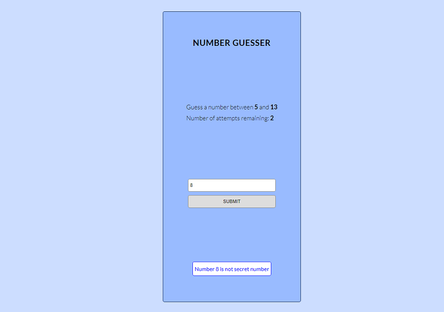

# Number Guesser

Number Guesser App in javascript. Guess number between some displayed range. App is made for both mobile and desktop views.
It contains one class NumberGuesser to keep all data.
## Tools & Technology used

- Visual Studio Code
- JavaScript
- HTML 
- SASS
